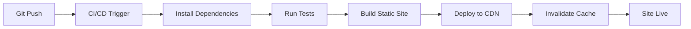

# Design Document: Rediseño Frontend-Only Restaurante Nueva Muralla

## Overview

Este documento describe el diseño técnico para la migración completa del sitio web del Restaurante Nueva Muralla desde una arquitectura full-stack (Node.js + Express + SQLite) a un sitio web estático frontend-only construido con Astro, Tailwind CSS y React.

### Objetivos del Rediseño

1. **Simplificación arquitectónica**: Eliminar toda la infraestructura de backend y base de datos
2. **Reducción de costos**: Hosting estático gratuito o de bajo costo (Netlify, Vercel, GitHub Pages)
3. **Mejora de performance**: Sitio pre-renderizado con carga instantánea
4. **Mantenibilidad**: Código más simple sin servidor ni base de datos
5. **Enfoque informativo**: Mostrar menú, contacto y ubicación sin funcionalidad de pedidos

### Alcance

**Incluye:**
- Visualización del menú completo con imágenes
- Filtrado interactivo por categorías
- Información de contacto telefónico
- Integración de Google Maps
- Diseño responsive con tema oriental
- Optimización de performance e imágenes

**Excluye (eliminado del sistema actual):**
- Sistema de pedidos online
- Carrito de compra
- Proceso de checkout
- Integración de pagos
- Panel administrativo
- API REST
- Base de datos SQLite
- Autenticación de usuarios

### Stack Tecnológico

- **Framework**: Astro 5.x (static site generation con islands architecture)
- **Estilos**: Tailwind CSS 3.4+
- **Interactividad**: React 18+ (solo para componentes interactivos)
- **Lenguaje**: TypeScript (type safety)
- **Optimización de imágenes**: Astro Image (built-in)
- **Deployment**: Netlify / Vercel / GitHub Pages

## Architecture

### Arquitectura de Islas (Islands Architecture)

El sitio utilizará la arquitectura de islas de Astro, donde:

1. **Contenido estático (océano)**: La mayor parte del sitio es HTML estático pre-renderizado
2. **Componentes interactivos (islas)**: Solo las partes que requieren interactividad se hidratan con JavaScript

```
┌─────────────────────────────────────────┐
│         HTML Estático (Astro)           │
│  ┌─────────────────────────────────┐   │
│  │  Header (estático)              │   │
│  └─────────────────────────────────┘   │
│  ┌─────────────────────────────────┐   │
│  │  Hero Section (estático)        │   │
│  └─────────────────────────────────┘   │
│  ┌─────────────────────────────────┐   │
│  │ ╔═══════════════════════════╗   │   │
│  │ ║ MenuFilter (React Island) ║   │   │ ← Hidratado con client:load
│  │ ║ - Estado del filtro       ║   │   │
│  │ ║ - Botones de categoría    ║   │   │
│  │ ╚═══════════════════════════╝   │   │
│  │                                 │   │
│  │  Lista de productos (estático)  │   │
│  └─────────────────────────────────┘   │
│  ┌─────────────────────────────────┐   │
│  │  Contact Section (estático)     │   │
│  └─────────────────────────────────┘   │
│  ┌─────────────────────────────────┐   │
│  │  Google Maps (iframe lazy)      │   │
│  └─────────────────────────────────┘   │
│  ┌─────────────────────────────────┐   │
│  │  Footer (estático)              │   │
│  └─────────────────────────────────┘   │
└─────────────────────────────────────────┘
```

### Flujo de Build y Deployment

```
┌──────────────┐
│  Desarrollo  │
│              │
│ npm run dev  │
└──────┬───────┘
       │
       ▼
┌──────────────────────────────┐
│  Astro Dev Server            │
│  - Hot Module Replacement    │
│  - TypeScript compilation    │
│  - Tailwind JIT compilation  │
└──────┬───────────────────────┘
       │
       │ npm run build
       ▼
┌──────────────────────────────┐
│  Build Process               │
│  1. Compile TypeScript       │
│  2. Process Tailwind CSS     │
│  3. Optimize images          │
│  4. Generate static HTML     │
│  5. Bundle minimal JS        │
│  6. Minify assets            │
└──────┬───────────────────────┘
       │
       ▼
┌──────────────────────────────┐
│  dist/ folder                │
│  - index.html                │
│  - _astro/*.css              │
│  - _astro/*.js (minimal)     │
│  - _astro/images/*           │
└──────┬───────────────────────┘
       │
       │ Deploy
       ▼
┌──────────────────────────────┐
│  Static Hosting (CDN)        │
│  - Netlify / Vercel          │
│  - GitHub Pages              │
│  - Cloudflare Pages          │
└──────────────────────────────┘
```

### Estrategia de Hidratación

Astro permite controlar cuándo y cómo se hidrata cada componente React:

| Directiva | Cuándo se hidrata | Uso en este proyecto |
|-----------|-------------------|----------------------|
| `client:load` | Inmediatamente al cargar la página | MenuFilter (crítico para UX) |
| `client:idle` | Cuando el navegador está inactivo | No usado |
| `client:visible` | Cuando el componente es visible | No usado (solo 1 isla) |
| `client:only` | Solo en el cliente, sin SSR | No usado |
| Sin directiva | Nunca (solo HTML estático) | Todos los demás componentes |

**Decisión**: Usar `client:load` para MenuFilter porque:
- Es el único componente interactivo
- Es visible above-the-fold
- La interactividad es crítica para la experiencia de usuario
- El bundle JS será mínimo (~10-15KB)

## Components and Interfaces

### Estructura de Carpetas

```
/
├── src/
│   ├── pages/
│   │   └── index.astro              # Página principal (única página)
│   ├── layouts/
│   │   └── BaseLayout.astro         # Layout base con <head>, meta tags
│   ├── components/
│   │   ├── astro/                   # Componentes Astro (estáticos)
│   │   │   ├── Header.astro
│   │   │   ├── Hero.astro
│   │   │   ├── MenuGrid.astro       # Grid de productos
│   │   │   ├── ProductCard.astro    # Tarjeta individual de producto
│   │   │   ├── ContactSection.astro
│   │   │   ├── MapSection.astro
│   │   │   └── Footer.astro
│   │   └── react/                   # Componentes React (interactivos)
│   │       └── MenuFilter.tsx       # Filtro de categorías (única isla)
│   ├── data/
│   │   ├── products.ts              # Datos de productos
│   │   ├── categories.ts            # Datos de categorías
│   │   └── contact.ts               # Información de contacto
│   ├── types/
│   │   └── index.ts                 # TypeScript interfaces
│   ├── styles/
│   │   └── global.css               # Estilos globales + Tailwind directives
│   └── utils/
│       └── helpers.ts               # Funciones auxiliares
├── public/
│   ├── images/
│   │   └── products/                # Imágenes de productos
│   └── favicon.svg
├── astro.config.mjs                 # Configuración de Astro
├── tailwind.config.mjs              # Configuración de Tailwind
├── tsconfig.json                    # Configuración de TypeScript
└── package.json
```

### Componentes Principales

#### 1. BaseLayout.astro (Layout)

```typescript
interface Props {
  title: string;
  description: string;
}
```

**Responsabilidades:**
- Estructura HTML base (`<html>`, `<head>`, `<body>`)
- Meta tags SEO (title, description, Open Graph)
- Importar estilos globales
- Configurar viewport y charset
- Incluir favicon

#### 2. Header.astro (Estático)

**Responsabilidades:**
- Logo del restaurante
- Nombre "Restaurante Nueva Muralla"
- Navegación simple (opcional: enlaces a secciones)
- Diseño con tema oriental (rojo/dorado)

#### 3. Hero.astro (Estático)

**Responsabilidades:**
- Sección hero con imagen de fondo o gradiente
- Título principal y subtítulo
- Call-to-action para ver el menú o llamar
- Elementos decorativos orientales sutiles

#### 4. MenuFilter.tsx (React Island - Interactivo)

```typescript
interface MenuFilterProps {
  categories: Category[];
  initialCategory?: string;
}

interface Category {
  id: string;
  nombre: string;
  orden: number;
}
```

**Responsabilidades:**
- Mantener estado de la categoría activa
- Renderizar botones de categorías
- Emitir eventos de cambio de categoría (via URL hash o state)
- Animaciones de transición
- Accesibilidad (ARIA labels, navegación por teclado)

**Estado interno:**
```typescript
const [activeCategory, setActiveCategory] = useState<string | null>(null);
```

**Interacción con MenuGrid:**
- Opción 1: URL hash (`#categoria-arroces`) - preferida por SEO y compartibilidad
- Opción 2: Custom event + localStorage
- Opción 3: Query parameter (`?category=arroces`)

**Decisión**: Usar URL hash para mantener el estado sin JavaScript adicional y permitir enlaces directos.

#### 5. MenuGrid.astro (Estático con filtrado CSS)

```typescript
interface Props {
  products: Product[];
}
```

**Responsabilidades:**
- Renderizar grid responsive de ProductCard
- Aplicar clases CSS para filtrado basado en hash
- Lazy loading de imágenes
- Animaciones de entrada

**Técnica de filtrado:**
```css
/* Mostrar todos por defecto */
.product-card { display: block; }

/* Ocultar todos cuando hay filtro activo */
body:has(#categoria-arroces:target) .product-card:not([data-category="arroces"]) {
  display: none;
}
```

#### 6. ProductCard.astro (Estático)

```typescript
interface Props {
  product: Product;
}
```

**Responsabilidades:**
- Mostrar imagen del producto (optimizada)
- Nombre del producto
- Descripción
- Precio en euros
- Atributo `data-category` para filtrado
- Diseño de tarjeta con tema oriental

#### 7. ContactSection.astro (Estático)

**Responsabilidades:**
- Número de teléfono (clickeable en móvil: `tel:`)
- Horario de atención
- Dirección física
- Call-to-action prominente
- Iconos decorativos

#### 8. MapSection.astro (Estático con iframe lazy)

**Responsabilidades:**
- Iframe de Google Maps embebido
- Lazy loading (`loading="lazy"`)
- Enlace para abrir en Google Maps app
- Responsive (aspect ratio 16:9 o 4:3)
- Fallback si iframe no carga

### Interfaces TypeScript

```typescript
// src/types/index.ts

export interface Product {
  id: string;
  nombre: string;
  descripcion: string;
  precio: number;
  categoriaId: string;
  imagenUrl: string;
  activo: boolean;
}

export interface Category {
  id: string;
  nombre: string;
  orden: number;
  activo: boolean;
}

export interface ContactInfo {
  telefono: string;
  horario: string;
  direccion: string;
  email?: string;
}

export interface MapConfig {
  embedUrl: string;
  placeUrl: string;
  lat: number;
  lng: number;
}
```

## Data Models

### Migración de Datos de SQLite a TypeScript

Los datos actualmente en SQLite se migrarán a archivos TypeScript estáticos:

#### src/data/categories.ts

```typescript
import type { Category } from '../types';

export const categories: Category[] = [
  {
    id: 'entrantes-sopas',
    nombre: 'Grupo 1º - Entradas y Sopas',
    orden: 1,
    activo: true
  },
  {
    id: 'arroz-tallarines',
    nombre: 'Grupo 2º - Arroz/Tallarines/Verduras',
    orden: 2,
    activo: true
  },
  {
    id: 'pescado-mariscos',
    nombre: 'Grupo 3º - Pescado/Mariscos',
    orden: 3,
    activo: true
  },
  {
    id: 'ternera',
    nombre: 'Grupo 4º - Ternera',
    orden: 4,
    activo: true
  },
  {
    id: 'cerdo',
    nombre: 'Grupo 5º - Cerdo',
    orden: 5,
    activo: true
  },
  {
    id: 'aves',
    nombre: 'Grupo 6º - Aves',
    orden: 6,
    activo: true
  },
  {
    id: 'especiales',
    nombre: 'Platos Especiales',
    orden: 7,
    activo: true
  }
];
```

#### src/data/products.ts

```typescript
import type { Product } from '../types';

export const products: Product[] = [
  {
    id: 'prod-001',
    nombre: 'Rollitos de Primavera',
    descripcion: 'Crujientes rollitos rellenos de verduras frescas',
    precio: 4.50,
    categoriaId: 'entrantes-sopas',
    imagenUrl: '/images/products/rollitos-primavera.jpg',
    activo: true
  },
  // ... más productos migrados de la base de datos
];
```

#### src/data/contact.ts

```typescript
import type { ContactInfo, MapConfig } from '../types';

export const contactInfo: ContactInfo = {
  telefono: '+34 XXX XXX XXX',
  horario: 'Lunes a Domingo: 12:00 - 16:00 y 19:00 - 23:30',
  direccion: 'Calle Ejemplo, 123, 28001 Madrid',
  email: 'info@nuevamuralla.es'
};

export const mapConfig: MapConfig = {
  embedUrl: 'https://www.google.com/maps/embed?pb=...',
  placeUrl: 'https://maps.google.com/?q=...',
  lat: 40.4168,
  lng: -3.7038
};
```

### Gestión de Imágenes

**Ubicación**: `public/images/products/`

**Formato recomendado**:
- Formato: WebP (con fallback JPEG)
- Dimensiones: 800x600px (aspect ratio 4:3)
- Optimización: Astro Image automática

**Convención de nombres**:
```
rollitos-primavera.jpg
arroz-tres-delicias.jpg
pato-pekin.jpg
```

**Optimización automática con Astro Image**:
```astro
---
import { Image } from 'astro:assets';
import rollitosPrimavera from '../images/products/rollitos-primavera.jpg';
---

<Image
  src={rollitosPrimavera}
  alt="Rollitos de Primavera"
  width={800}
  height={600}
  loading="lazy"
  format="webp"
/>
```

## Error Handling

### Estrategias de Manejo de Errores

Dado que es un sitio estático, los errores son principalmente de build-time o runtime del navegador:

#### 1. Errores de Build-Time

**Validación de datos**:
```typescript
// src/utils/validation.ts

export function validateProducts(products: Product[]): void {
  products.forEach(product => {
    if (!product.id || !product.nombre) {
      throw new Error(`Producto inválido: ${JSON.stringify(product)}`);
    }
    if (product.precio <= 0) {
      throw new Error(`Precio inválido para ${product.nombre}`);
    }
    if (!product.imagenUrl) {
      console.warn(`Producto sin imagen: ${product.nombre}`);
    }
  });
}
```

**Validación de imágenes**:
- Verificar que todas las imágenes referenciadas existen en `public/images/products/`
- Script de validación pre-build

#### 2. Errores de Runtime (Navegador)

**Imágenes faltantes**:
```astro

```

**Google Maps no carga**:
```astro
<div class="map-container">
  <iframe
    src={mapConfig.embedUrl}
    loading="lazy"
    referrerpolicy="no-referrer-when-downgrade"
  ></iframe>
  <noscript>
    <p>
      <a href={mapConfig.placeUrl} target="_blank">
        Ver ubicación en Google Maps
      </a>
    </p>
  </noscript>
</div>
```

**JavaScript deshabilitado**:
- El filtro de categorías no funcionará, pero todo el contenido será visible
- Mensaje informativo:
```html
<noscript>
  <div class="noscript-warning">
    Para una mejor experiencia, habilita JavaScript en tu navegador.
  </div>
</noscript>
```

#### 3. Páginas de Error

**404.astro**:
```astro
---
// src/pages/404.astro
import BaseLayout from '../layouts/BaseLayout.astro';
---

<BaseLayout title="Página no encontrada - Nueva Muralla">
  <div class="error-page">
    <h1>404 - Página no encontrada</h1>
    <p>Lo sentimos, la página que buscas no existe.</p>
    <a href="/">Volver al inicio</a>
  </div>
</BaseLayout>
```

## Testing Strategy

### Enfoque de Testing para Sitio Estático

Este proyecto **NO es apropiado para property-based testing** porque:
- Es un sitio estático informativo sin lógica de negocio compleja
- No hay procesamiento de datos dinámico
- No hay backend ni API
- La mayoría del contenido es presentacional

### Estrategias de Testing Recomendadas

#### 1. Build Validation Tests

**Objetivo**: Verificar que el sitio se construye correctamente

```bash
# package.json
{
  "scripts": {
    "test:build": "astro build && node scripts/validate-build.js"
  }
}
```

**Validaciones**:
- Todas las páginas se generan sin errores
- Todos los assets se copian correctamente
- No hay enlaces rotos
- Todas las imágenes referenciadas existen

#### 2. Data Validation Tests

**Objetivo**: Verificar integridad de datos estáticos

```typescript
// tests/data-validation.test.ts

import { describe, it, expect } from 'vitest';
import { products } from '../src/data/products';
import { categories } from '../src/data/categories';

describe('Data Validation', () => {
  it('todos los productos tienen campos requeridos', () => {
    products.forEach(product => {
      expect(product.id).toBeTruthy();
      expect(product.nombre).toBeTruthy();
      expect(product.precio).toBeGreaterThan(0);
      expect(product.categoriaId).toBeTruthy();
    });
  });

  it('todas las categorías de productos existen', () => {
    const categoryIds = categories.map(c => c.id);
    products.forEach(product => {
      expect(categoryIds).toContain(product.categoriaId);
    });
  });

  it('todas las imágenes de productos existen', () => {
    // Verificar que los archivos existen en public/images/products/
  });
});
```

#### 3. Component Snapshot Tests

**Objetivo**: Detectar cambios no intencionados en el HTML generado

```typescript
// tests/components/ProductCard.test.ts

import { experimental_AstroContainer as AstroContainer } from 'astro/container';
import { expect, test } from 'vitest';
import ProductCard from '../../src/components/astro/ProductCard.astro';

test('ProductCard renderiza correctamente', async () => {
  const container = await AstroContainer.create();
  const result = await container.renderToString(ProductCard, {
    props: {
      product: {
        id: 'test-1',
        nombre: 'Rollitos de Primavera',
        descripcion: 'Crujientes rollitos',
        precio: 4.50,
        categoriaId: 'entrantes',
        imagenUrl: '/images/test.jpg',
        activo: true
      }
    }
  });

  expect(result).toContain('Rollitos de Primavera');
  expect(result).toContain('4.50');
  expect(result).toContain('data-category="entrantes"');
});
```

#### 4. Visual Regression Tests (Opcional)

**Herramienta**: Playwright + Percy o Chromatic

```typescript
// tests/visual/homepage.spec.ts

import { test, expect } from '@playwright/test';

test('homepage visual regression', async ({ page }) => {
  await page.goto('http://localhost:4321');
  await expect(page).toHaveScreenshot('homepage.png');
});

test('menu filter interaction', async ({ page }) => {
  await page.goto('http://localhost:4321');
  await page.click('button:has-text("Arroz")');
  await expect(page).toHaveScreenshot('menu-filtered.png');
});
```

#### 5. Accessibility Tests

**Herramienta**: axe-core + Playwright

```typescript
// tests/a11y/accessibility.spec.ts

import { test, expect } from '@playwright/test';
import AxeBuilder from '@axe-core/playwright';

test('homepage no tiene violaciones de accesibilidad', async ({ page }) => {
  await page.goto('http://localhost:4321');
  
  const accessibilityScanResults = await new AxeBuilder({ page })
    .withTags(['wcag2a', 'wcag2aa'])
    .analyze();

  expect(accessibilityScanResults.violations).toEqual([]);
});
```

#### 6. Performance Tests

**Herramienta**: Lighthouse CI

```yaml
# .github/workflows/lighthouse.yml

name: Lighthouse CI
on: [push]
jobs:
  lighthouse:
    runs-on: ubuntu-latest
    steps:
      - uses: actions/checkout@v3
      - uses: actions/setup-node@v3
      - run: npm ci
      - run: npm run build
      - run: npx @lhci/cli@0.12.x autorun
```

**Configuración**:
```javascript
// lighthouserc.js

module.exports = {
  ci: {
    collect: {
      staticDistDir: './dist',
    },
    assert: {
      assertions: {
        'categories:performance': ['error', { minScore: 0.9 }],
        'categories:accessibility': ['error', { minScore: 0.9 }],
        'categories:best-practices': ['error', { minScore: 0.9 }],
        'categories:seo': ['error', { minScore: 0.9 }],
      },
    },
  },
};
```

### Testing Configuration

```json
// package.json
{
  "scripts": {
    "test": "vitest",
    "test:unit": "vitest run",
    "test:build": "astro build && node scripts/validate-build.js",
    "test:e2e": "playwright test",
    "test:a11y": "playwright test tests/a11y",
    "test:visual": "playwright test tests/visual"
  },
  "devDependencies": {
    "vitest": "^1.0.0",
    "@playwright/test": "^1.40.0",
    "@axe-core/playwright": "^4.8.0"
  }
}
```

### Testing Summary

| Tipo de Test | Herramienta | Frecuencia | Objetivo |
|--------------|-------------|------------|----------|
| Data Validation | Vitest | Pre-commit | Integridad de datos |
| Component Snapshots | Vitest + Astro Container | Pre-commit | Regresión de componentes |
| Build Validation | Custom script | CI/CD | Build exitoso |
| Visual Regression | Playwright | CI/CD | Cambios visuales |
| Accessibility | axe-core | CI/CD | WCAG AA compliance |
| Performance | Lighthouse CI | CI/CD | Score > 90 |

**Nota importante**: No se implementarán property-based tests porque este proyecto no tiene lógica de negocio compleja que se beneficie de testing basado en propiedades universales. Los tests de validación de datos y snapshots son suficientes para garantizar la calidad del sitio estático.


## Configuración de Tailwind CSS

### Tema Personalizado Oriental

```javascript
// tailwind.config.mjs

/** @type {import('tailwindcss').Config} */
export default {
  content: ['./src/**/*.{astro,html,js,jsx,md,mdx,svelte,ts,tsx,vue}'],
  theme: {
    extend: {
      colors: {
        primary: {
          DEFAULT: '#c8102e',
          dark: '#a00d24',
          light: '#e6143a',
        },
        accent: {
          DEFAULT: '#d4af37',
          dark: '#b8941f',
          light: '#f4d03f',
        },
        dark: {
          DEFAULT: '#1a1a1a',
          gray: '#333333',
        },
      },
      fontFamily: {
        sans: ['Inter', 'system-ui', 'sans-serif'],
        display: ['Playfair Display', 'serif'],
      },
      backgroundImage: {
        'pattern-chinese': "url('/images/pattern-chinese.svg')",
      },
      animation: {
        'fade-in': 'fadeIn 0.5s ease-in-out',
        'slide-up': 'slideUp 0.6s ease-out',
      },
      keyframes: {
        fadeIn: {
          '0%': { opacity: '0' },
          '100%': { opacity: '1' },
        },
        slideUp: {
          '0%': { transform: 'translateY(20px)', opacity: '0' },
          '100%': { transform: 'translateY(0)', opacity: '1' },
        },
      },
    },
  },
  plugins: [],
};
```

### Estilos Globales

```css
/* src/styles/global.css */

@tailwind base;
@tailwind components;
@tailwind utilities;

@layer base {
  :root {
    --color-primary: #c8102e;
    --color-accent: #d4af37;
    --color-dark: #1a1a1a;
  }

  body {
    @apply bg-white text-dark font-sans antialiased;
  }

  h1, h2, h3, h4, h5, h6 {
    @apply font-display;
  }
}

@layer components {
  /* Botón estilo oriental */
  .btn-primary {
    @apply bg-primary hover:bg-primary-dark text-white font-semibold py-3 px-6 rounded-lg transition-colors duration-200;
  }

  .btn-accent {
    @apply bg-accent hover:bg-accent-dark text-dark font-semibold py-3 px-6 rounded-lg transition-colors duration-200;
  }

  /* Tarjeta de producto */
  .product-card {
    @apply bg-white rounded-lg shadow-md hover:shadow-xl transition-shadow duration-300 overflow-hidden;
  }

  /* Separador decorativo oriental */
  .divider-chinese {
    @apply relative flex items-center justify-center my-8;
  }

  .divider-chinese::before,
  .divider-chinese::after {
    content: '';
    @apply flex-1 border-t border-accent;
  }

  .divider-chinese span {
    @apply px-4 text-accent text-2xl;
  }
}

@layer utilities {
  /* Efecto de brillo dorado */
  .text-glow-gold {
    text-shadow: 0 0 10px rgba(212, 175, 55, 0.5);
  }

  /* Patrón de fondo sutil */
  .bg-pattern-subtle {
    background-image: 
      linear-gradient(45deg, rgba(212, 175, 55, 0.03) 25%, transparent 25%),
      linear-gradient(-45deg, rgba(212, 175, 55, 0.03) 25%, transparent 25%);
    background-size: 20px 20px;
  }
}
```

## Configuración de Astro

### astro.config.mjs

```javascript
import { defineConfig } from 'astro/config';
import react from '@astrojs/react';
import tailwind from '@astrojs/tailwind';

export default defineConfig({
  site: 'https://restaurantenuevamurallla.com', // Actualizar con dominio real
  integrations: [
    react(),
    tailwind({
      applyBaseStyles: false, // Usamos nuestro global.css
    }),
  ],
  output: 'static',
  build: {
    inlineStylesheets: 'auto',
  },
  image: {
    service: {
      entrypoint: 'astro/assets/services/sharp',
    },
  },
  vite: {
    build: {
      cssMinify: true,
      minify: 'terser',
    },
  },
});
```

### tsconfig.json

```json
{
  "extends": "astro/tsconfigs/strict",
  "compilerOptions": {
    "jsx": "react-jsx",
    "jsxImportSource": "react",
    "baseUrl": ".",
    "paths": {
      "@/*": ["src/*"],
      "@components/*": ["src/components/*"],
      "@data/*": ["src/data/*"],
      "@types/*": ["src/types/*"],
      "@utils/*": ["src/utils/*"]
    }
  }
}
```

## Optimización de Performance

### Estrategias de Optimización

#### 1. Optimización de Imágenes

**Astro Image automático**:
- Conversión a WebP
- Generación de múltiples tamaños (responsive)
- Lazy loading por defecto
- Placeholder blur (opcional)

```astro
---
import { Image } from 'astro:assets';
import productImage from '../images/products/producto.jpg';
---

<Image
  src={productImage}
  alt="Nombre del producto"
  width={800}
  height={600}
  loading="lazy"
  format="webp"
  quality={80}
/>
```

#### 2. Minimización de JavaScript

**Estrategia**:
- Solo 1 componente React (MenuFilter)
- Hidratación con `client:load` (único componente interactivo)
- Bundle esperado: ~10-15KB gzipped

**Alternativa sin React** (consideración futura):
```javascript
// Vanilla JS para filtrado (si se quiere eliminar React completamente)
document.querySelectorAll('.category-btn').forEach(btn => {
  btn.addEventListener('click', (e) => {
    const category = e.target.dataset.category;
    window.location.hash = `categoria-${category}`;
  });
});
```

#### 3. CSS Optimization

**Tailwind purge**:
- Automático en producción
- Solo incluye clases usadas
- CSS esperado: ~15-20KB gzipped

#### 4. Lazy Loading

**Google Maps**:
```astro
<iframe
  src={mapConfig.embedUrl}
  loading="lazy"
  width="600"
  height="450"
  style="border:0;"
  allowfullscreen=""
  referrerpolicy="no-referrer-when-downgrade"
></iframe>
```

**Imágenes de productos**:
- Todas con `loading="lazy"`
- Excepto las primeras 3-4 (above the fold)

#### 5. Preload Critical Assets

```astro
---
// src/layouts/BaseLayout.astro
---
<head>
  <link rel="preload" href="/fonts/inter.woff2" as="font" type="font/woff2" crossorigin>
  <link rel="preconnect" href="https://maps.googleapis.com">
</head>
```

### Métricas de Performance Objetivo

| Métrica | Objetivo | Estrategia |
|---------|----------|------------|
| **Lighthouse Performance** | > 90 | HTML estático, JS mínimo, imágenes optimizadas |
| **First Contentful Paint (FCP)** | < 1.5s | Pre-rendering, CSS inline crítico |
| **Largest Contentful Paint (LCP)** | < 2.5s | Optimización de imágenes hero, preload |
| **Time to Interactive (TTI)** | < 3.5s | Hidratación mínima, lazy loading |
| **Cumulative Layout Shift (CLS)** | < 0.1 | Dimensiones explícitas en imágenes |
| **Total Bundle Size** | < 100KB | Solo 1 isla React, Tailwind purgado |

## SEO y Accesibilidad

### SEO Optimization

#### Meta Tags

```astro
---
// src/layouts/BaseLayout.astro
const { title, description } = Astro.props;
---
<head>
  <meta charset="UTF-8">
  <meta name="viewport" content="width=device-width, initial-scale=1.0">
  <title>{title}</title>
  <meta name="description" content={description}>
  
  <!-- Open Graph -->
  <meta property="og:type" content="website">
  <meta property="og:title" content={title}>
  <meta property="og:description" content={description}>
  <meta property="og:image" content="/images/og-image.jpg">
  
  <!-- Twitter Card -->
  <meta name="twitter:card" content="summary_large_image">
  <meta name="twitter:title" content={title}>
  <meta name="twitter:description" content={description}>
  
  <!-- Local Business Schema -->
  <script type="application/ld+json">
    {
      "@context": "https://schema.org",
      "@type": "Restaurant",
      "name": "Restaurante Nueva Muralla",
      "image": "/images/restaurant.jpg",
      "telephone": "+34-XXX-XXX-XXX",
      "address": {
        "@type": "PostalAddress",
        "streetAddress": "Calle Ejemplo, 123",
        "addressLocality": "Madrid",
        "postalCode": "28001",
        "addressCountry": "ES"
      },
      "servesCuisine": "Chinese",
      "priceRange": "$$"
    }
  </script>
</head>
```

#### Sitemap

```xml
<!-- public/sitemap.xml -->
<?xml version="1.0" encoding="UTF-8"?>
<urlset xmlns="http://www.sitemaps.org/schemas/sitemap/0.9">
  <url>
    <loc>https://restaurantenuevamurallla.com/</loc>
    <lastmod>2026-01-15</lastmod>
    <changefreq>weekly</changefreq>
    <priority>1.0</priority>
  </url>
</urlset>
```

#### robots.txt

```
# public/robots.txt
User-agent: *
Allow: /
Sitemap: https://restaurantenuevamurallla.com/sitemap.xml
```

### Accesibilidad (WCAG AA)

#### Contraste de Colores

| Combinación | Ratio | Cumple WCAG AA |
|-------------|-------|----------------|
| Rojo (#c8102e) sobre blanco | 7.2:1 | ✅ AAA |
| Dorado (#d4af37) sobre negro | 8.1:1 | ✅ AAA |
| Negro (#1a1a1a) sobre blanco | 15.8:1 | ✅ AAA |

#### Navegación por Teclado

```astro
<!-- MenuFilter.tsx -->
<button
  type="button"
  aria-pressed={activeCategory === category.id}
  aria-label={`Filtrar por ${category.nombre}`}
  onClick={() => handleCategoryClick(category.id)}
  onKeyDown={(e) => {
    if (e.key === 'Enter' || e.key === ' ') {
      handleCategoryClick(category.id);
    }
  }}
>
  {category.nombre}
</button>
```

#### ARIA Labels

```astro
<nav aria-label="Categorías del menú">
  <MenuFilter categories={categories} />
</nav>

<section aria-label="Productos del menú">
  <MenuGrid products={products} />
</section>

<section aria-label="Información de contacto">
  <ContactSection />
</section>
```

#### Skip Links

```astro
<a href="#main-content" class="skip-link">
  Saltar al contenido principal
</a>

<style>
  .skip-link {
    position: absolute;
    top: -40px;
    left: 0;
    background: var(--color-primary);
    color: white;
    padding: 8px;
    text-decoration: none;
    z-index: 100;
  }
  
  .skip-link:focus {
    top: 0;
  }
</style>
```

#### Tamaños Táctiles

```css
/* Mínimo 44x44px para elementos interactivos */
.category-btn {
  @apply min-h-[44px] min-w-[44px] px-6 py-3;
}

.product-card {
  @apply min-h-[44px]; /* Para áreas clickeables */
}
```

## Deployment

### Opciones de Hosting

#### Opción 1: Netlify (Recomendado)

**Ventajas**:
- Deploy automático desde Git
- CDN global
- HTTPS gratuito
- Formularios y funciones serverless (si se necesitan en el futuro)
- Previews de pull requests

**Configuración**:
```toml
# netlify.toml
[build]
  command = "npm run build"
  publish = "dist"

[[redirects]]
  from = "/*"
  to = "/index.html"
  status = 200

[build.environment]
  NODE_VERSION = "20"
```

#### Opción 2: Vercel

**Ventajas**:
- Integración perfecta con frameworks modernos
- Edge network global
- Analytics incluido
- Previews automáticos

**Configuración**:
```json
{
  "buildCommand": "npm run build",
  "outputDirectory": "dist",
  "framework": "astro"
}
```

#### Opción 3: GitHub Pages

**Ventajas**:
- Gratuito para repositorios públicos
- Integración directa con GitHub

**Configuración**:
```yaml
# .github/workflows/deploy.yml
name: Deploy to GitHub Pages

on:
  push:
    branches: [main]

jobs:
  build:
    runs-on: ubuntu-latest
    steps:
      - uses: actions/checkout@v3
      - uses: actions/setup-node@v3
        with:
          node-version: 20
      - run: npm ci
      - run: npm run build
      - uses: peaceiris/actions-gh-pages@v3
        with:
          github_token: ${{ secrets.GITHUB_TOKEN }}
          publish_dir: ./dist
```

### Variables de Entorno

```bash
# .env.example
PUBLIC_SITE_URL=https://restaurantenuevamurallla.com
PUBLIC_GOOGLE_MAPS_API_KEY=your_api_key_here
```

**Nota**: En Astro, las variables con prefijo `PUBLIC_` son accesibles en el cliente.

### Proceso de Deployment



## Migration Plan

### Plan de Migración del Sistema Actual

#### Fase 1: Preparación (1-2 días)

1. **Backup completo**:
   - Exportar base de datos SQLite
   - Backup de imágenes de productos
   - Backup del código actual

2. **Análisis de datos**:
   - Contar productos activos
   - Listar categorías
   - Identificar imágenes faltantes

3. **Setup del nuevo proyecto**:
   ```bash
   npm create astro@latest nueva-muralla-astro
   cd nueva-muralla-astro
   npm install
   npx astro add react tailwind
   ```

#### Fase 2: Migración de Datos (2-3 días)

1. **Script de migración de productos**:
   ```javascript
   // scripts/migrate-products.js
   const Database = require('better-sqlite3');
   const fs = require('fs');
   
   const db = new Database('../database.db');
   const products = db.prepare('SELECT * FROM productos WHERE activo = 1').all();
   const categories = db.prepare('SELECT * FROM categorias WHERE activo = 1').all();
   
   // Generar src/data/products.ts
   const productsTS = `
   import type { Product } from '../types';
   
   export const products: Product[] = ${JSON.stringify(products, null, 2)};
   `;
   
   fs.writeFileSync('../src/data/products.ts', productsTS);
   ```

2. **Migración de imágenes**:
   - Copiar de `public/images/products/` (actual) a `public/images/products/` (nuevo)
   - Optimizar imágenes (resize, compress)
   - Convertir a WebP

3. **Validación de datos**:
   - Ejecutar tests de validación
   - Verificar que todas las referencias son correctas

#### Fase 3: Desarrollo de Componentes (3-5 días)

1. **Componentes estáticos** (día 1-2):
   - BaseLayout.astro
   - Header.astro
   - Hero.astro
   - ProductCard.astro
   - ContactSection.astro
   - MapSection.astro
   - Footer.astro

2. **Componente interactivo** (día 3):
   - MenuFilter.tsx (React)
   - Integración con URL hash

3. **Página principal** (día 4):
   - index.astro
   - Integración de todos los componentes

4. **Estilos** (día 5):
   - Configuración de Tailwind
   - Tema oriental personalizado
   - Responsive design

#### Fase 4: Testing y Optimización (2-3 días)

1. **Testing**:
   - Tests de validación de datos
   - Tests de componentes
   - Tests de accesibilidad
   - Lighthouse audit

2. **Optimización**:
   - Optimización de imágenes
   - Minimización de bundles
   - Performance tuning

3. **Cross-browser testing**:
   - Chrome, Firefox, Safari
   - iOS Safari, Android Chrome
   - Diferentes tamaños de pantalla

#### Fase 5: Deployment (1 día)

1. **Setup de hosting**:
   - Crear cuenta en Netlify/Vercel
   - Conectar repositorio Git
   - Configurar dominio

2. **Deploy inicial**:
   - Build de producción
   - Deploy a staging
   - Verificación completa

3. **Go live**:
   - Deploy a producción
   - Actualizar DNS (si es necesario)
   - Monitoreo post-deployment

#### Fase 6: Documentación y Handoff (1 día)

1. **Documentación**:
   - README actualizado
   - Guía de mantenimiento
   - Guía para agregar/editar productos

2. **Training** (si es necesario):
   - Cómo editar productos
   - Cómo agregar imágenes
   - Cómo hacer deploy

### Checklist de Migración

- [ ] Backup completo del sistema actual
- [ ] Exportar datos de SQLite
- [ ] Migrar imágenes de productos
- [ ] Crear proyecto Astro
- [ ] Configurar Tailwind CSS
- [ ] Migrar datos a TypeScript
- [ ] Desarrollar componentes estáticos
- [ ] Desarrollar MenuFilter (React)
- [ ] Implementar diseño responsive
- [ ] Integrar Google Maps
- [ ] Tests de validación
- [ ] Tests de accesibilidad
- [ ] Lighthouse audit (score > 90)
- [ ] Cross-browser testing
- [ ] Setup de hosting
- [ ] Deploy a staging
- [ ] Verificación completa
- [ ] Deploy a producción
- [ ] Actualizar documentación
- [ ] Monitoreo post-deployment

### Rollback Plan

En caso de problemas críticos:

1. **Mantener el sistema actual activo** durante la migración
2. **DNS switch**: Cambiar DNS de vuelta al servidor actual
3. **Backup restoration**: Restaurar desde backup si es necesario
4. **Comunicación**: Notificar a stakeholders

### Timeline Estimado

| Fase | Duración | Dependencias |
|------|----------|--------------|
| Preparación | 1-2 días | - |
| Migración de datos | 2-3 días | Preparación |
| Desarrollo | 3-5 días | Migración de datos |
| Testing | 2-3 días | Desarrollo |
| Deployment | 1 día | Testing |
| Documentación | 1 día | Deployment |
| **Total** | **10-15 días** | - |

## Maintenance and Future Enhancements

### Mantenimiento Regular

#### Actualización de Productos

**Proceso**:
1. Editar `src/data/products.ts`
2. Agregar imagen a `public/images/products/`
3. Commit y push
4. Deploy automático

**Ejemplo**:
```typescript
// Agregar nuevo producto
{
  id: 'prod-042',
  nombre: 'Pato Laqueado',
  descripcion: 'Pato crujiente con salsa especial',
  precio: 18.50,
  categoriaId: 'aves',
  imagenUrl: '/images/products/pato-laqueado.jpg',
  activo: true
}
```

#### Actualización de Información de Contacto

```typescript
// src/data/contact.ts
export const contactInfo: ContactInfo = {
  telefono: '+34 XXX XXX XXX', // Actualizar aquí
  horario: 'Lunes a Domingo: 12:00 - 16:00 y 19:00 - 23:30',
  direccion: 'Calle Ejemplo, 123, 28001 Madrid',
};
```

### Mejoras Futuras (Opcional)

#### 1. Multiidioma (Español + Chino)

```typescript
// src/i18n/index.ts
export const translations = {
  es: {
    menu: 'Menú',
    contact: 'Contacto',
    // ...
  },
  zh: {
    menu: '菜单',
    contact: '联系方式',
    // ...
  }
};
```

#### 2. Búsqueda de Productos

```typescript
// Componente React para búsqueda
<SearchBar products={products} />
```

#### 3. Modo Oscuro

```javascript
// Tailwind dark mode
module.exports = {
  darkMode: 'class',
  // ...
};
```

#### 4. Animaciones Avanzadas

```javascript
// Framer Motion para animaciones
import { motion } from 'framer-motion';

<motion.div
  initial={{ opacity: 0, y: 20 }}
  animate={{ opacity: 1, y: 0 }}
  transition={{ duration: 0.5 }}
>
  <ProductCard product={product} />
</motion.div>
```

#### 5. PWA (Progressive Web App)

```javascript
// astro.config.mjs
import { defineConfig } from 'astro/config';
import pwa from '@vite-pwa/astro';

export default defineConfig({
  integrations: [
    pwa({
      registerType: 'autoUpdate',
      manifest: {
        name: 'Restaurante Nueva Muralla',
        short_name: 'Nueva Muralla',
        description: 'Restaurante chino en Madrid',
        theme_color: '#c8102e',
        icons: [
          {
            src: '/icon-192.png',
            sizes: '192x192',
            type: 'image/png'
          },
          {
            src: '/icon-512.png',
            sizes: '512x512',
            type: 'image/png'
          }
        ]
      }
    })
  ]
});
```

### Monitoreo y Analytics

#### Google Analytics 4

```astro
---
// src/layouts/BaseLayout.astro
---
<head>
  <!-- Google Analytics -->
  <script async src="https://www.googletagmanager.com/gtag/js?id=G-XXXXXXXXXX"></script>
  <script>
    window.dataLayer = window.dataLayer || [];
    function gtag(){dataLayer.push(arguments);}
    gtag('js', new Date());
    gtag('config', 'G-XXXXXXXXXX');
  </script>
</head>
```

#### Plausible Analytics (Alternativa privacy-friendly)

```astro
<script defer data-domain="restaurantenuevamurallla.com" src="https://plausible.io/js/script.js"></script>
```

## Conclusión

Este diseño proporciona una arquitectura sólida, moderna y mantenible para el rediseño del sitio web del Restaurante Nueva Muralla. La migración de un sistema full-stack a un sitio estático con Astro ofrece:

✅ **Simplicidad**: Sin backend, sin base de datos, sin complejidad innecesaria  
✅ **Performance**: Lighthouse score > 90, carga instantánea  
✅ **Costos**: Hosting gratuito o muy económico  
✅ **Mantenibilidad**: Código TypeScript type-safe, estructura clara  
✅ **Escalabilidad**: Fácil agregar nuevas funcionalidades en el futuro  
✅ **SEO**: HTML estático pre-renderizado, meta tags optimizados  
✅ **Accesibilidad**: WCAG AA compliance, navegación por teclado  

El proyecto está listo para iniciar la fase de implementación siguiendo el plan de migración detallado.
